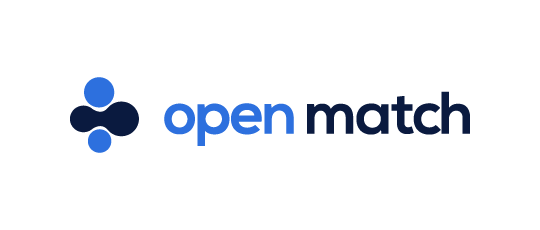

[](https://godoc.org/github.com/GoogleCloudPlatform/open-match)
[](https://goreportcard.com/report/github.com/GoogleCloudPlatform/open-match)
[](https://github.com/GoogleCloudPlatform/open-match/blob/master/LICENSE)

Open Match is an open source game matchmaking framework designed to allow game creators to build matchmakers of any size easily and with as much possibility for sharing and code re-use as possible. It’s designed to be flexible, extensible, and scalable.

Matchmaking begins when a player tells the game that they want to play. Every player has a set of attributes like skill, location, playtime, win-lose ratio, etc which may factor in how they are paired with other players. Typically, there's a trade off between the quality of the match vs the time to wait. Since Open Match is designed to scale with the player population, it should be possible to still have high quality matches while having high player count.

Under the covers matchmaking approaches touch on significant areas of computer science including graph theory and massively concurrent processing. Open Match is an effort to provide a foundation upon which these difficult problems can be addressed by the wider game development community. As Josh Menke &mdash; famous for working on matchmaking for many popular triple-A franchises &mdash; put it:

["Matchmaking, a lot of it actually really is just really good engineering. There's a lot of really hard networking and plumbing problems that need to be solved, depending on the size of your audience."](https://youtu.be/-pglxege-gU?t=830)

This project attempts to solve the networking and plumbing problems, so game developers can focus on the logic to match players into great games.

## Open Match Demo

This section lists the steps to set up a demo for the basic functionality of Open Match. If you just want to see an E2E Open Match setup in action, please continue with this section. If you want to build Open Match from source, or modify the match functions, please follow the [Development Guide](docs/development.md).

### Create a Kubernetes Cluster

Open Match framework is a collection of servers that run within a Kubernetes cluster. Having a Kubernetes cluster is a prerequisite to deploying Open Match. If you want to deploy Open Match to an existing Kubernetes cluster, skip this step and proceed to Deploying Open Match, otherwise create a kubernetes cluster with one of the options listed below:

* [Set up a Google Cloud Kubernetes Cluster](docs/gcloud.md) (*this may involve extra charges unless you are on free tier*)
* [Set up a Local Minikube cluster](https://kubernetes.io/docs/setup/minikube/)

### Deploying Open Match

Run the following steps to deploy core Open Match components and the monitoring services in the Kubernetes cluster.

```bash
# Create a cluster role binding (if using gcloud on Linux or OSX)
kubectl create clusterrolebinding cluster-admin-binding --clusterrole cluster-admin --user `gcloud config get-value account`

# Create a cluster role binding (if using gcloud on Windows)
for /F %i in ('gcloud config get-value account') do kubectl create clusterrolebinding cluster-admin-binding --clusterrole cluster-admin --user %i

# Create a cluster role binding (if using minikube)
kubectl create clusterrolebinding cluster-admin-binding --clusterrole=cluster-admin --serviceaccount=kube-system:default

# Create a namespace to place all the Open Match components in.
kubectl create namespace open-match

# Install the core Open Match and monitoring services.
kubectl apply -f https://github.com/GoogleCloudPlatform/open-match/releases/download/v0.5.0/install.yaml --namespace open-match
```

### Deploy demo components

Open Match framework requires the user to author a custom match function and an evaluator that are invoked to create matches. For demo purposes, we will use an example MMF and Evaluator. The following command deploys these in the kubernetes cluster:

```bash
# Install the example MMF and Evaluator.
kubectl apply -f https://github.com/GoogleCloudPlatform/open-match/releases/download/v0.5.0/install-example.yaml --namespace open-match
```

This command also deploys a component that continuously generates players with different properties and adds them to Open Match state storage. This is because a populated player pool is required to generate matches.

### Generate Matches!

In a real setup, a game backend (Director / DGS etc.) will request Open Match for matches. For demo purposes, this is simulated by a backend client that requests Open Match to continuously list matches till it runs out of players.

```bash
# Install the example MMF and Evaluator.
kubectl run om-backendclient --rm --restart=Never --image-pull-policy=Always -i --tty --image=gcr.io/open-match-public-images/openmatch-backendclient:latest --namespace=open-match
```

If successful, the backend client should successfully generate matches, displaying players populated in Rosters.

### Cleanup

To delete Open Match from this cluster, simply run:

```bash
kubectl delete namespace open-match
```

## Documentation

Here are some useful links to additional documentation:

* [Future Roadmap](docs/roadmap.md)
* [Open Match Concepts](docs/concepts.md)
* [Development Guide](docs/development.md)
* [Open Match Integrations](docs/integrations.md)
* [References](docs/references.md)

For more information on the technical underpinnings of Open Match you can refer to the [docs/](docs/) directory.

## Contributing

Please read the [contributing](CONTRIBUTING.md) guide for directions on submitting Pull Requests to Open Match.

See the [Development guide](docs/development.md) for documentation for development and building Open Match from source.

Open Match is in active development - we would love your help in shaping its future!

## Support

* [Slack Channel](https://open-match.slack.com/) ([Signup](https://join.slack.com/t/open-match/shared_invite/enQtNDM1NjcxNTY4MTgzLWQzMzE1MGY5YmYyYWY3ZjE2MjNjZTdmYmQ1ZTQzMmNiNGViYmQyN2M4ZmVkMDY2YzZlOTUwMTYwMzI1Y2I2MjU))
* [File an Issue](https://github.com/GoogleCloudPlatform/open-match/issues/new)
* [Mailing list](https://groups.google.com/forum/#!forum/open-match-discuss)
* [Managed Service Survey](https://goo.gl/forms/cbrFTNCmy9rItSv72)

## Code of Conduct

Participation in this project comes under the [Contributor Covenant Code of Conduct](code-of-conduct.md)

## Disclaimer
This software is currently alpha, and subject to change. Although Open Match has already been used to run [production workloads within Google](https://cloud.google.com/blog/topics/inside-google-cloud/no-tricks-just-treats-globally-scaling-the-halloween-multiplayer-doodle-with-open-match-on-google-cloud), but it's still early days on the way to our final goal. There's plenty left to write and we welcome contributions. **We strongly encourage you to engage with the community through the [Slack or Mailing lists](#support) if you're considering using Open Match in production before the 1.0 release, as the documentation is likely to lag behind the latest version a bit while we focus on getting out of alpha/beta as soon as possible.**
